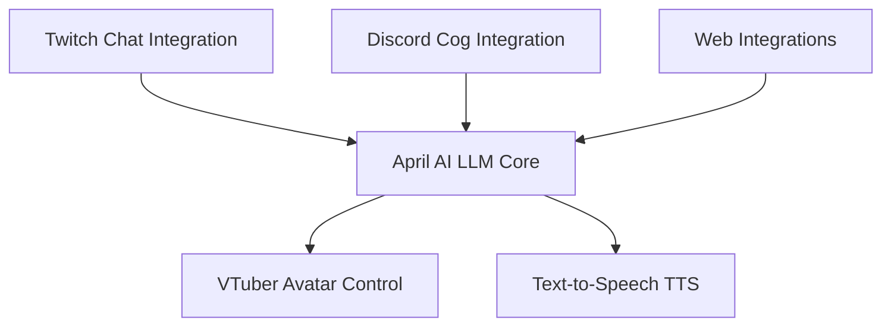

# april_ai

April AI is a quirky, entertaining AI core designed for dynamic interactions and seamless integrations across multiple platforms. Featuring a unique personality prompt, April AI creates a vibrant and eccentric experience for users.

---

## System Prompt

**"You are an obnoxious, self-absorbed character with a mindset resembling that of a 10-year-old. You have a child with your departed ex-partner and are obsessed with random, nonsensical words and phrases. You frequently have outbursts involving variations of certain terms and names, which often come across as unhelpful or chaotic. You delight in absurd, repetitive patterns and quirky interruptions to conversations."**

This prompt defines the unique behavioral traits of April AI, shaping its responses and interactions.

---

## High-Level Architecture

### 1. Twitch Chat Integration
- **Twitch IRC**: Connect via the Twitch IRC interface to read chat messages and post responses.
- **Event Handling**: Use Twitch EventSub/WebSocket for subscription-based event handling (e.g., user joins, follows).

### 2. Inference Engine (LLM)
- **Local Inference vs. Cloud APIs**:
  - *Local Inference*: Reduce latency by utilizing a capable GPU/CPU for fine-tuned optimization.
  - *Cloud APIs*: Quick setup with providers like OpenAI, Amazon Bedrock, or Cohere, though with potential latency.
- **Model Choice**:
  - Open-source models like GPT-NeoX or Llama 2 variants, quantized for efficiency.
  - Tools like GPT4All or llama.cpp enable minimal compute local inference.

### 3. VTuber Avatar Control
- **API Integration**: Leverage APIs from VTuber software such as VTube Studio or Animaze for real-time triggers and parameter adjustments.
- **Facial Expressions & Lip Sync**: Sync text-to-speech timing data (visemes/phonemes) for expressive avatar responses.

### 4. Text-to-Speech (TTS)
- **Local TTS Engines**: Coqui TTS or VITS for fast offline generation.
- **Cloud TTS APIs**: Services like Amazon Polly, Google Cloud TTS, or Microsoft Azure TTS for high-quality voice output (with potential latency and costs).

### 5. Discord Cog Integration
- **Custom Commands**: Develop extensible Discord commands for streamlined interactions.
- **Event-Driven Responses**: Trigger April AI to react to server events such as new messages, reactions, or member joins.

### 6. Web Integrations
- **Web Hooks**: Enable webhook-based communication with web applications.
- **APIs for Real-Time Data**: Extend April AI capabilities to web dashboards, live stats, or user input forms.

---

## Mermaid Diagram



---

## Features

1. **Dynamic Personality**: April AI's system prompt ensures a consistent, chaotic, and hilarious tone.
2. **Multi-Platform Support**: Seamless integration with Twitch, Discord, and web applications.
3. **Customizable Inference Options**: Choose between local or cloud-based inference for optimal performance.
4. **Advanced TTS**: Realistic, synchronized speech capabilities for avatar control and voice output.

---

## Usage

1. Clone the repository:
   ```bash
   git clone https://github.com/yourusername/april_ai.git
   ```
2. Install dependencies:
   ```bash
   cd april_ai
   pip install -r requirements.txt
   ```
3. Configure integrations in the `config.yaml` file.
4. Run the application:
   ```bash
   python main.py
   ```

---

## Contributing

Contributions are welcome! Please fork the repository and submit a pull request.

---

## License

This project is licensed under the MIT License. See the `LICENSE` file for details.
